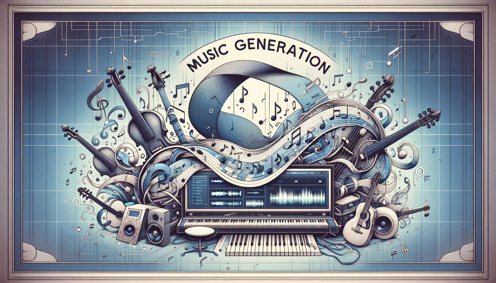
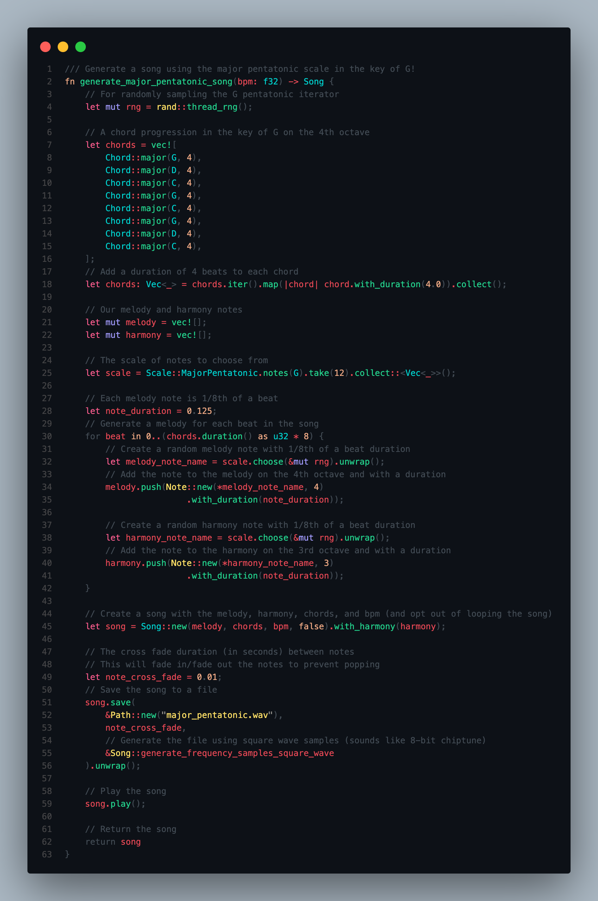

# music-generation

[](https://adam-mcdaniel.github.io/music)

This repository implements a music generation library in Rust, with the goal of creating a simple and easy-to-use API for generating music. The library is designed to be flexible and extensible, allowing users to create their own custom music generation algorithms. Additionally, it also supports compilation for the web using WebAssembly, allowing users to generate music directly in the browser.

## Features

- Generate `.wav` files from custom music generation algorithms
- Easily manipulating scales, chords, melodies, and harmonies
- Built-in support for common scales and chords, including major, minor, pentatonic, blues, diminished, augmented, and more!
- Music playback using [`rodio`](https://crates.io/crates/rodio) (with the `playback` feature enabled)
- Supports directly sampling the generated audio data with custom wave functions, with builtin support for sine, square, and sawtooth waves
- WebAssembly support for generating music in the browser

## Music Examples

Here are some examples of the music generation library in action, some of them sound pretty cool! I particularly like the chip-tune sound of the square wave. The sawtooth is good for a more aggressive sound, and the sine wave is good for a more mellow sound.

The major and minor scales are the most common scales in Western music, and are great for creating melodies and harmonies. The pentatonic scales are also very common, and are great for creating simple and catchy songs. The blues scales are more distinctive and are great for creating a more soulful sound.

<!-- Put links on the names, not in a separate listen link -->
***[Click here to listen on my music player in the web](https://adam-mcdaniel.github.io/music), or on the links below to download the examples!***
<!-- 
| Major | Examples | Minor | Examples |
|----------|----------|-------|----------|
| Major Blues Scale | ▹ [Chiptune Major Blues](examples/square_major_blues.wav)<br> ▹ [Sawtooth Major Blues](examples/sawtooth_major_blues.wav)<br> ▹ [Sine Major Blues](examples/sine_major_blues.wav) | Minor Blues Scale | ▹ [Chiptune Minor Blues](examples/square_minor_blues.wav)<br> ▹ [Sawtooth Minor Blues](examples/sawtooth_minor_blues.wav)<br> ▹ [Sine Minor Blues](examples/sine_minor_blues.wav) |
| Major Pentatonic Scale | ▹ [Chiptune Major Pentatonic](examples/square_major_pentatonic.wav)<br> ▹ [Sawtooth Major Pentatonic](examples/sawtooth_major_pentatonic.wav)<br> ▹ [Sine Major Pentatonic](examples/sine_major_pentatonic.wav) | Minor Pentatonic Scale | ▹ [Chiptune Minor Pentatonic](examples/square_minor_pentatonic.wav)<br> ▹ [Sawtooth Minor Pentatonic](examples/sawtooth_minor_pentatonic.wav)<br> ▹ [Sine Minor Pentatonic](examples/sine_minor_pentatonic.wav) | -->

<!-- Link to raw content instead -->
| Major | Examples | Minor | Examples |
|----------|----------|-------|----------|
| Major Blues Scale | ▹ [Chiptune Major Blues](https://raw.githubusercontent.com/adam-mcdaniel/music-generation/main/examples/square_major_blues.wav)<br> ▹ [Sawtooth Major Blues](https://raw.githubusercontent.com/adam-mcdaniel/music-generation/main/examples/sawtooth_major_blues.wav)<br> ▹ [Sine Major Blues](https://raw.githubusercontent.com/adam-mcdaniel/music-generation/main/examples/sine_major_blues.wav) | Minor Blues Scale | ▹ [Chiptune Minor Blues](https://raw.githubusercontent.com/adam-mcdaniel/music-generation/main/examples/square_minor_blues.wav)<br> ▹ [Sawtooth Minor Blues](https://raw.githubusercontent.com/adam-mcdaniel/music-generation/main/examples/sawtooth_minor_blues.wav)<br> ▹ [Sine Minor Blues](https://raw.githubusercontent.com/adam-mcdaniel/music-generation/main/examples/sine_minor_blues.wav) |
| Major Pentatonic Scale | ▹ [Chiptune Major Pentatonic](https://raw.githubusercontent.com/adam-mcdaniel/music-generation/main/examples/square_major_pentatonic.wav)<br> ▹ [Sawtooth Major Pentatonic](https://raw.githubusercontent.com/adam-mcdaniel/music-generation/main/examples/sawtooth_major_pentatonic.wav)<br> ▹ [Sine Major Pentatonic](https://raw.githubusercontent.com/adam-mcdaniel/music-generation/main/examples/sine_major_pentatonic.wav) | Minor Pentatonic Scale | ▹ [Chiptune Minor Pentatonic](https://raw.githubusercontent.com/adam-mcdaniel/music-generation/main/examples/square_minor_pentatonic.wav)<br> ▹ [Sawtooth Minor Pentatonic](https://raw.githubusercontent.com/adam-mcdaniel/music-generation/main/examples/sawtooth_minor_pentatonic.wav)<br> ▹ [Sine Minor Pentatonic](https://raw.githubusercontent.com/adam-mcdaniel/music-generation/main/examples/sine_minor_pentatonic.wav) |

These examples below are a bit more experimental in their sound due to the nature of the scales. The diminished scale is a bit more dissonant, while the augmented scale is a bit more exotic. They can be used to create some interesting and unique sounds, especially when combined with other scales and chords. They're great for creating a spooky or mysterious atmosphere.

| Diminished | Examples | Augmented | Examples |
|------------|----------|-----------|----------|
| Diminished Scale | ▹ [Chiptune Diminished](https://raw.githubusercontent.com/adam-mcdaniel/music-generation/main/examples/square_diminished.wav)<br> ▹ [Sawtooth Diminished](https://raw.githubusercontent.com/adam-mcdaniel/music-generation/main/examples/sawtooth_diminished.wav)<br> ▹ [Sine Diminished](https://raw.githubusercontent.com/adam-mcdaniel/music-generation/main/examples/sine_diminished.wav) | Augmented Scale | ▹ [Chiptune Augmented](https://raw.githubusercontent.com/adam-mcdaniel/music-generation/main/examples/square_augmented.wav)<br> ▹ [Sawtooth Augmented](https://raw.githubusercontent.com/adam-mcdaniel/music-generation/main/examples/sawtooth_augmented.wav)<br> ▹ [Sine Augmented](https://raw.githubusercontent.com/adam-mcdaniel/music-generation/main/examples/sine_augmented.wav) |

<!-- | Diminished | Examples | Augmented | Examples |
|------------|----------|-----------|----------|
| Diminished Scale | ▹ [Chiptune Diminished](examples/square_diminished.wav)<br> ▹ [Sawtooth Diminished](examples/sawtooth_diminished.wav)<br> ▹ [Sine Diminished](examples/sine_diminished.wav) | Augmented Scale | ▹ [Chiptune Augmented](examples/square_augmented.wav)<br> ▹ [Sawtooth Augmented](examples/sawtooth_augmented.wav)<br> ▹ [Sine Augmented](examples/sine_augmented.wav) | -->

<!-- | Diminished | Examples | Augmented | Examples |
|------------|----------|-----------|----------|
| Diminished Scale | ▹ Chiptune Diminished <br><audio src="examples/square_diminished.wav" controls></audio><br> ▹ Sawtooth Diminished <br><audio src="examples/sawtooth_diminished.wav" controls></audio><br> ▹ Sine Diminished <br><audio src="examples/sine_diminished.wav" controls></audio> | Augmented Scale | ▹ Chiptune Augmented <br><audio src="examples/square_augmented.wav" controls></audio><br> ▹ Sawtooth Augmented <br><audio src="examples/sawtooth_augmented.wav" controls></audio><br> ▹ Sine Augmented <br><audio src="examples/sine_augmented.wav" controls></audio> | -->


## Usage

To use the music generation library, add the following to your `Cargo.toml`:

```toml
[dependencies]
music-generation = { git="https://github.com/adam-mcdaniel/music-generation" }
```

For playback support, enable the `playback` feature:

```toml
[dependencies]
music-generation = { git="https://github.com/adam-mcdaniel/music-generation", features = ["playback"] }
```

For web assembly support, enable the `web` feature:

```toml
[dependencies]
music-generation = { git="https://github.com/adam-mcdaniel/music-generation", features = ["web"] }
```

This crate is a library, but it also includes a binary that randomly generates songs using all the scales mentioned above, even though the library itself supports much more. To run the binary, use the following command:

```bash
cargo run --release --features playback
```

This will generate several `.wav` files in the project directory that you can listen to. I used this to generate the examples above!

## Example Usage

Here's an example of how to generate a simple song using the music generation library:



### Code Snippet Example

Here's the example code as a code snippet you can copy and paste into your project:

```rust
// Import the music generation library and its dependencies
use music_generator::*;
use NoteType::*;
// Import the random number generator
use rand::prelude::*;

/// Generate a song using the major pentatonic scale in the key of G!
fn generate_major_pentatonic_song(bpm: f32) -> Song {
    // For randomly sampling the G pentatonic iterator
    let mut rng = rand::thread_rng();

    // A chord progression in the key of G on the 4th octave
    let chords = vec![
        Chord::major(G, 4),
        Chord::major(D, 4),
        Chord::major(C, 4),
        Chord::major(G, 4),
        Chord::major(C, 4),
        Chord::major(G, 4),
        Chord::major(D, 4),
        Chord::major(C, 4),
    ];
    // Add a duration of 4 beats to each chord
    let chords: Vec<_> = chords.iter().map(|chord| chord.with_duration(4.0)).collect();

    // Our melody and harmony notes
    let mut melody = vec![];
    let mut harmony = vec![];

    // The scale of notes to choose from
    let scale = Scale::MajorPentatonic.notes(G).take(12).collect::<Vec<_>>();

    // Each melody note is 1/8th of a beat
    let note_duration = 0.125;
    // Generate a melody for each beat in the song
    for beat in 0..(chords.duration() as u32 * 8) {
        // Create a random melody note with 1/8th of a beat duration
        let melody_note_name = scale.choose(&mut rng).unwrap();
        // Add the note to the melody on the 4th octave and with a duration
        melody.push(Note::new(*melody_note_name, 4)
                        .with_duration(note_duration));

        // Create a random harmony note with 1/8th of a beat duration
        let harmony_note_name = scale.choose(&mut rng).unwrap();
        // Add the note to the harmony on the 3rd octave and with a duration
        harmony.push(Note::new(*harmony_note_name, 3)
                        .with_duration(note_duration));
    }

    // Create a song with the melody, harmony, chords, and bpm
    // (and opt out of looping the song)
    let song = Song::new(melody, chords, bpm, false).with_harmony(harmony);

    // The cross fade duration (in seconds) between notes
    // This will fade in/fade out the notes to prevent popping
    let note_cross_fade = 0.01;
    // Save the song to a file
    song.save(
        &Path::new("major_pentatonic.wav"),
        note_cross_fade,
        // Generate the file using square wave samples (sounds like 8-bit chiptune)
        &Song::generate_frequency_samples_square_wave
    ).unwrap();

    // Play the song
    song.play();
    
    // Return the song
    return song
}
```

## Author Notes

This project was really fun to work on, I loved getting to experiment with new music theory concepts! A lot of these scales and chords were new to me, and they're more difficult to play on the guitar than they are to generate in code. I'm also very pleased with the results of the music generation, the songs sound pretty good!

## License

This project is licensed under the MIT License - see the [LICENSE](LICENSE) file for details.
